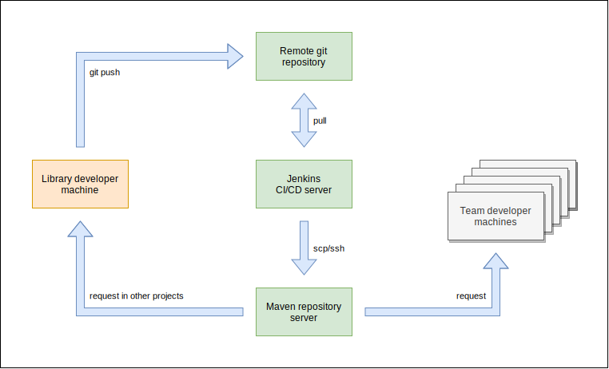
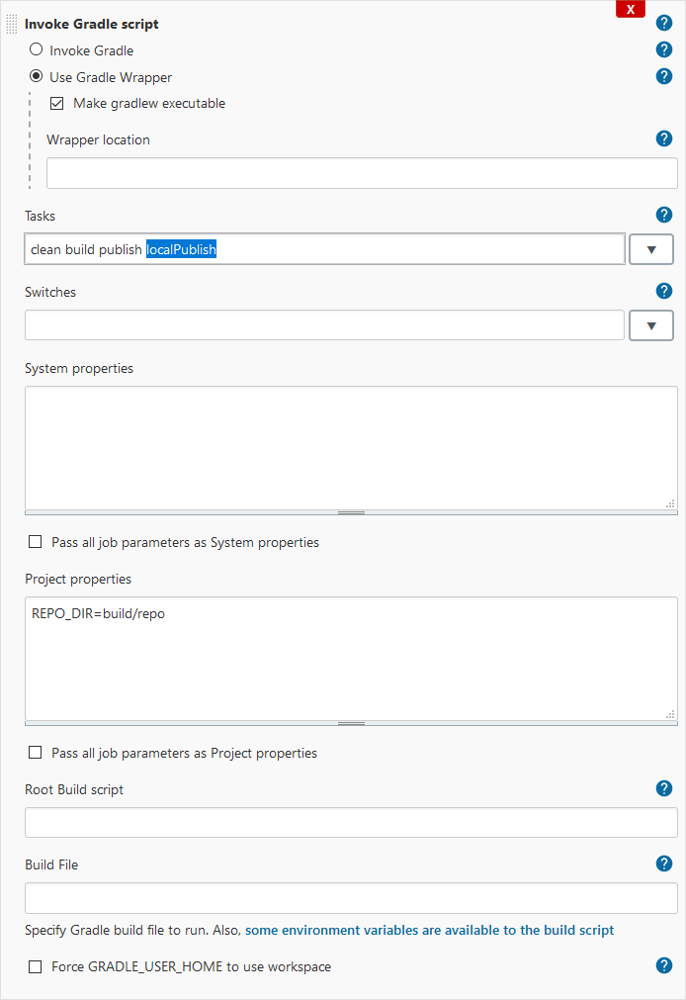
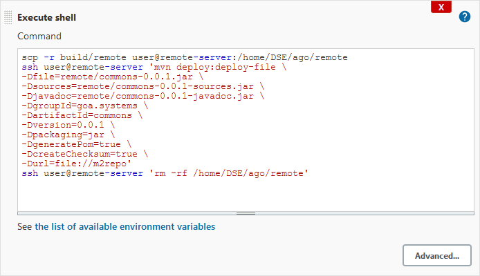

# Publishing local artefacts to a remote repository

## Used technologies and starting point

This example uses the following technologies to provide a development and publishing environment for a Java library. This library offers standard functionality e.g. for a coding team within a company. The code is tested using unit tests and the library is build, tested and packaged with [Gradle](https://www.gradle.org). The library requires Java 1.8 or higher (9 - 15, ...) to run.

Until this point the project solely exists on the developers machine. This means it is coded, tested and run only on the machine of the developing user and other users in the team do not have access to the code. This is the starting point of this concept.

The goal is to provide the library to a team, a organization or the whole world depending of the developers focus. The architecture is the same. The difference is the accessibility of the remote repository.

For this project I am working with my commons library on [GitHub](https://github.com/andreasgottardi/goa.systems.commons). The following diagram shows the basic development lifecycle.



This can be extended to alpha , beta  and release candidate repositories and has to be defined in the team.

**The developer does not deploy artefacts to the Maven repository directly. He defines tests that are executed by the CI pipeline when changes are pushed and if they are successful the artefact gets published to the Maven repository by the build environment.**

## Local publish

A Gradle task exports the generated jar files into a defined folder. This is done using a copy task to iterate over the locally published repository and taking only files with the ending ".jar". The task used is called ```localPublish```. This task is part of the Gradle build tasks. "REPO_DIR" defines the relative folder where Gradle generates the local Maven repository.



## Copy to server by CI environment

Jenkins copies the generated artefacts to the remote artefact repository. This is done using a public key authentication and "scp". If a public key is set up, the following command sends the whole folder to the remote server:

```bash
scp -r build/remote user@remote-server:/home/user/remote
```

## Remote deployment on artefact server

The commands in this step require, that Java and Maven are set up and are available in the ```$PATH``` variable. For this example the software is installed under ```/opt```

```bash
user@remote-server:/opt$ ls -l
drwxr-xr-x 3 root root 4096 Feb 6 11:28 java
drwxr-xr-x 3 root root 4096 Feb 6 11:26 maven

user@remote-server:/opt$ ls -l java
lrwxrwxrwx  1 root root   37 Feb 6 11:28 stable -> zulu11.45.27-ca-jdk11.0.10-linux_x64/
drwxrwxr-x 10  500  500 4096 Feb 6 11:28 zulu11.45.27-ca-jdk11.0.10-linux_x64

user@remote-server:/opt$ ls -l maven
drwxr-xr-x 6 root root 4096 Feb 6 11:26 3.6.3
```

The application path information is added to the global path in the file ```/etc/bash.bashrc```:

```bash
export M2_HOME=$HOME/.m2
export PATH=/opt/maven/3.6.3/bin:$PATH
export JAVA_HOME=/opt/java/stable
export PATH=$JAVA_HOME/bin:$PATH
```

These lines must be added **before** the following line in order to be available in a non-login shell (like when command is called via ssh in the next step).

```bash
# If not running interactively, don't do anything
[ -z "$PS1" ] && return
```

Maven is used to deploy the artefacts into a repository folder. This is started from the Jenkins server and is executed by this command:

```bash
ssh user@remote-server 'mvn deploy:deploy-file \
-Dfile=remote/commons-0.0.1.jar \
-Dsources=remote/commons-0.0.1-sources.jar \
-Djavadoc=remote/commons-0.0.1-javadoc.jar \
-DgroupId=goa.systems \
-DartifactId=commons \
-Dversion=0.0.1 \
-Dpackaging=jar \
-DgeneratePom=true \
-DcreateChecksum=true \
-Durl=file://m2repo'
```

This command takes the jar files, evaluates the current and generates the new metadata in the folder "m2repo". The Jenkins task looks like this then:


