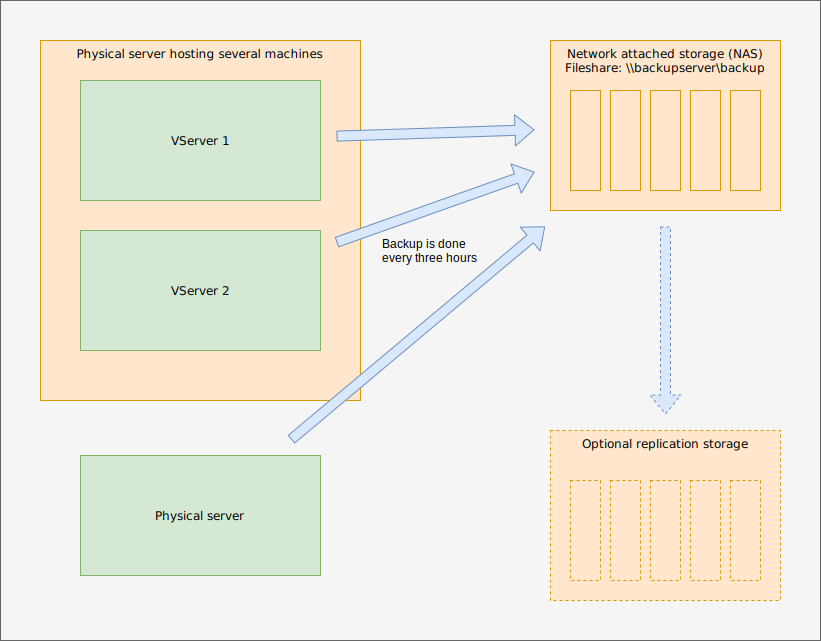
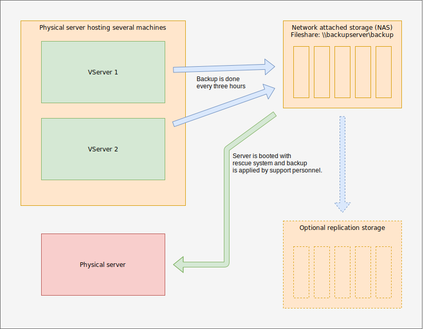

# Cost efficient server backup and restore for small and medium businesses
## Targeted group
* Small- and medium businesses with about 1 to 5 physical or virtual servers.
* Servers running business applications, databases or infrastructure based on Windows Server 2016 and higher.
* Servers running on physical or virtual ([ESXi](https://www.vmware.com/at/products/esxi-and-esx.html), [HyperV](https://docs.microsoft.com/de-de/virtualization/hyper-v-on-windows), [KVM](https://www.linux-kvm.org), [Xen](https://xenproject.org), ...) hosts with access to a network and storage system (dedicated NAS or remote server) via SMB (Windows share) protocol.
## Goals and benefits
* Cost efficient and secure backup and reasonable restore time depending on the size of the machine.
* Restore of servers in case of total failure.
* Backup of whole server system and restore without reinstalling and reconfiguration of specific software.
* Maximum time of data loss: 3 hours. This means, if a system fails and can not be restored conventionally the backup is maximum 3 hours old.
* Restore is feasible by trained support personnel with usage of a manual.
* In case of a virtual environment error analysis is possible. The failed machine is kept for developers to analyze the cause of failure.
## Cost and used applications
* The backup and restore is implemented using [Veeam Agent for Microsoft Windows FREE](https://www.veeam.com/de/windows-endpoint-server-backup-free.html)
* Restore media for use with USB sticks or mounted as bootable media into a virtual machine is offered as ISO file.
* Costs only arise for the virtual environment, if used, servers, NAS space or remote backup servers.
* Backups are configured as tasks and can be scheduled as required (more often, only in times with low system load, only once a day, ...)
## Non-goals
* The system is not designed to be managed remotely by a management server. Management is done on the server itself. This can be achieved by upgrading to a paid license.
* The system does not automatically restore and/or switch to a running machine in case of error. This has to be done manually by educated personnel.
* There is no reporting or notification in case of error included. This has to be done separately.
## Extensions
Due to the fact that state of the art products, that allow upgrades to versions with increased functions, are used, this concept can be expanded in the future to support centralized management, automatic backup and restore, notifications in case of error and central user management.
## Process examples
### Backup

The backup is configured on the servers itself and runs in a defined interval. Process status can be ovserved on the server in a control program.

### Restore

Assumption: The physical server failed, the harddrive has been replaced and it is ready for restoring. The used software provides a bootable component, that can be launched from a USB stick, a CD/DVD-Rom or can be mounted into a virtual machine. The server is then booted from the generated boot device and restoration is done in a few simple steps. After the process is done, the server is restarted and can be used regular.

