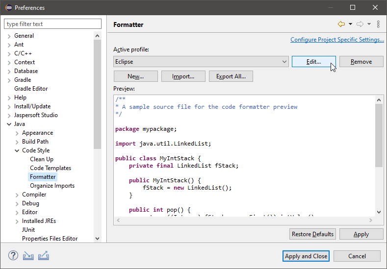

# Improve code quality in Eclipse

Source code is volatile and when a team is working on the same code it can get let's say "messy". Especially when unused stuff is not removed and obsolete practices are applied. And to be honest, when the task of changing the logic is done I don't start cleaning up my code. Fortunately there is support to take care of that during the coding process. Because I am working mainly with Eclipse I will show a few features of this particular IDE that keep the code clean. I will only show the Java formatter here, but it will give you a basic idea about the functionality and the practices can be applied to other languages as well.

## Why is it useful to define a company wide code style?

### Easier to read code

When code has the same style it makes it easier for developers to read the code of others. A new developer does not have to worry to do something wrong because the whole code style and formatting is defined in the IDE during setup.

### Only the real changes are committed

Imagine changing one line of code, saving the file and because you are using a formatter and the other developer doesn't the whole file gets formatted. Thus all the formatting changes get committed.

### Reduced Warnings

Before and after saving:

 

Unused imports are removed automatically. This makes code easier to read, reduces code size and is in general good practice.

## Formatter

Formatters do exactly, what the name says: They format your code. The formatter gets started manually by pressing [Crtl]+[Shift]+[F] when a source file is opened. Then the indents, spaces and syntax gets cleaned up. Formatters are configured in the Eclipse preferences basically under the following path "<Language (i.e. Java)> - Code Style - Formatter":

Starting from this point some organizational tasks can be done:

* Create and edit formatters
* Import- and export formatter definitions (as xml files)
* Open the configuration dialog

## Save actions

Formatters are great, but they have to be applied every time manually by selecting the appropriate menu item. Fortunately there are "Save actions". These actions can apply formatters automatically when saving a file.

## SonarLint

[Sonarlint](https://www.sonarlint.org) analyzes the source code during coding, shows categorized hints and provides improvements. The tool is available as [plugin for Eclipse](https://marketplace.eclipse.org/content/sonarlint).