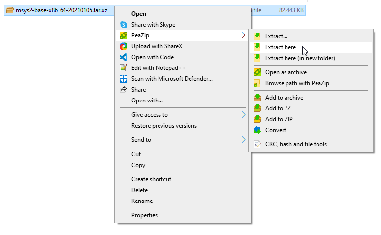
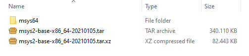
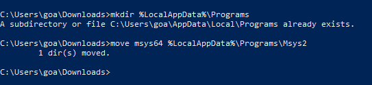
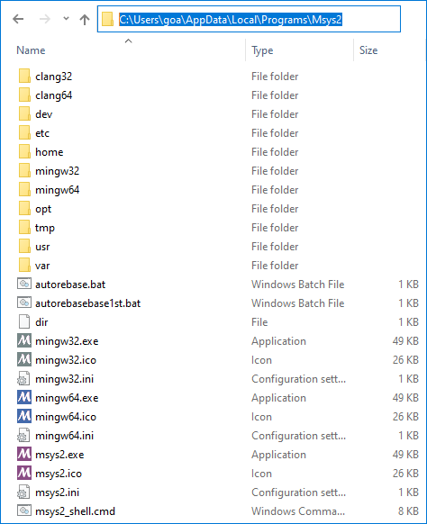
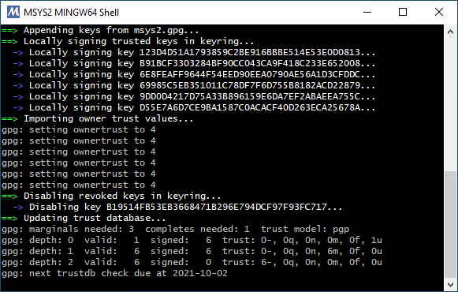
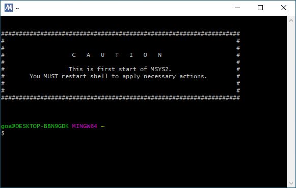
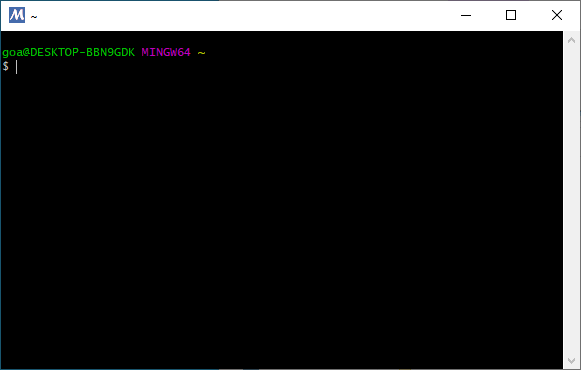
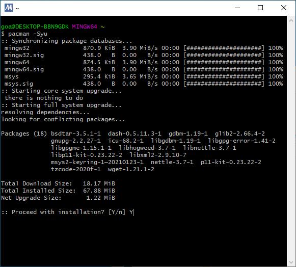
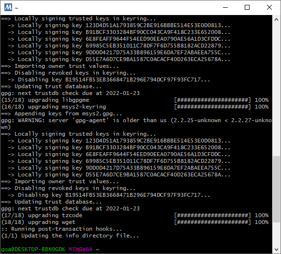
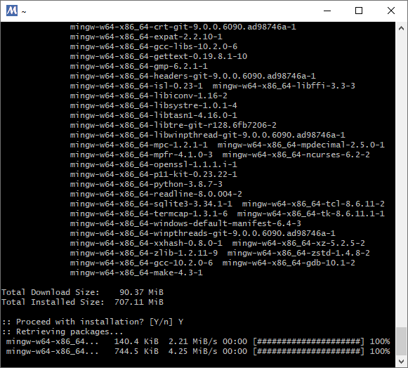

# Setting up gcc for C/C++ development

It can be tricky to get a compiler suite up and running and there are a few things to keep in mind when setting up these programs. This guide provides assistance to achieve this goal.

## Goals and scopes

When finishd the program "gcc" (and "gdb", "make", etc.) will be available globally. This means, that a console like PowerShell or cmd can be opened anywhere on the system and the command "gcc" is available and can be executed to compile a regular c file.

```bash
goa@MY-HOST MINGW64 ~
$ gcc
gcc.exe: fatal error: no input files
compilation terminated.
```

This is the output when called without a c file specified. It fails, but the program is available. To achieve this goal a system called "[Msys2](https://www.msys2.org)" is used. There is an installer available and feel free to use it. In this guide here the tar.gz distribution is used to demonstrate the whole process of integration.

## Acquiring the software

Unfortunately the tar.gz distribution is hidden and not directly accessible from the website. The distributions are listed on [this page](https://repo.msys2.org/distrib/x86_64). Take the latest version. For example the archive https://repo.msys2.org/distrib/x86_64/msys2-base-x86_64-20210105.tar.xz is from the 5th of January 2021 and it is the latest version there was when writing this tutorial. Look at the list and pick the latest version. Save it somewhere on your system.

To extract you need a program like [PeaZip](https://peazip.github.io) or [7zip](https://www.7-zip.de). With this tools you can extract the tar.gz file. The filename indicates, that that it is a tar file (**t**ape **ar**chiver) that is compressed with **xz**. Thus it has to be extracted twice because it is a uncompressed archive in a compressed archive.



This generates the file **"msys2-base-x86_64-20210105.tar"** which has to be extracted by repeating the extraction step on the new file. In the end the folder should look like this:



This shows how much space can be saved by compressing the tar file.

## Install

"Move" the folder to the install location. It worked out best for me to put it under the path

```cmd
%LocalAppData%\Progams\Msys2
```
So basically the following command will move the application into the correct directory.

```
mkdir %LocalAppData%\Programs
move msys64 %LocalAppData%\Programs\Msys2
```



The installation then should look like this:



To start the configuration start the file **"mingw64.exe"**. This opens a command line window and the first output is from the initialization tasks. There are a few things that need to be set up.



As soon as the following screen is shown, type in "exit" and confirm with [ENTER].



Open **"mingw64.exe"**. The following screen should appear.



Type in "pacman -Syu" and confirm with [ENTER]. When the line "Proceed with installation? [Y/n]" shows up, press [Y] and [ENTER] to continue installation:



When everything is done, a prompt is shown and the initial installation process is done.



Type in "exit" and confirm with [ENTER]. This is just to be sure that all installation processes are finished. On the next start the screen should look like this:


Type in the following command to install the compiler suite. The packages are downloaded and installed automatically. When the line "Proceed with installation? [Y/n]" shows up, press [Y] and [ENTER] to continue installation.

```bash
pacman -S mingw64/mingw-w64-x86_64-gdb mingw64/mingw-w64-x86_64-gcc mingw64/mingw-w64-x86_64-make
```



When everything is done, the compiler is located under

```cmd
%LocalAppData%\Programs\Msys2\mingw64\bin
```

This is also the path that should be added to the global path in the next chapter. This is just temporary: When working with multiple development environments it is better to not configure the application globally because it might interfere with other applications. But for starters this is okay.

## Integration into system

## Updating

## The first program
